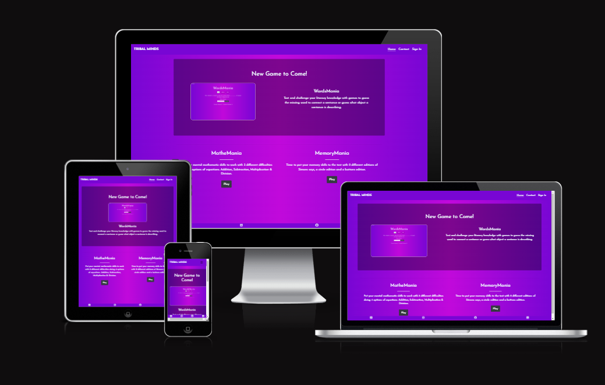
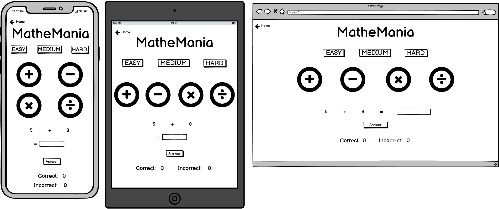
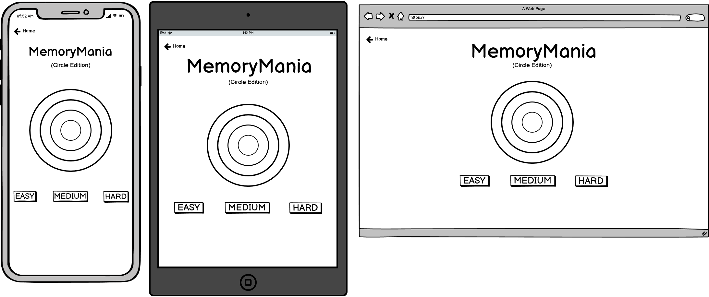
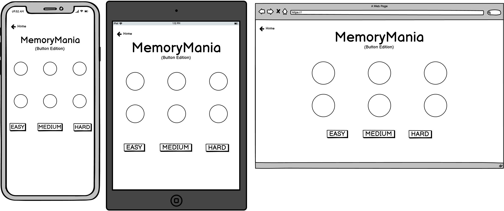

# Tribal Minds

Click here to vist the Tribal Minds website https://abaron21.github.io/Tribal_Minds

## Project Purpose
Expanding on the static website style with basic user interaction & expierience, the website that will be built is going to extend that interaction with funcionality programmed through JS (JavaScript) and external APIs. The intended purpose for the website is for user to access different games on the website either being a mind game or maths game and also to be able to send feedback on the website.

----
## User Stories
As a user I want to be able to switch between the different web pages so I can navigate easily around the website.

As a user I would like to see the different difficulties of the games so I can choose to play easy, medium or hard difficulty.

As a user I would like to know the different versions of the memory game so I can decide which one I want to play.

As a user I want to read feedback from other users so I can see what the games are like before playing.

As a user I would like to be able to send feedback to the developer so I can give a positive review or some suggestions for future developments.

----
## Features
* Games with Easy, Medium & Hard difficulties:
    * Memory game with either buttons or circles.
        * Each difficulty will change the the max number of turns a turn will need to reach in order to complete that difficulty, i.e easy - 10 medium - 20 etc.
    * Maths game
        * The difficulties change the factors that the number generator takes into account for each operand within the game, easy - 25 medium - 50 hard - 100.
* Reviews from previous users.
* Sending feedback via Email.
* See plans for new games to come.

----
## Future Features
* Multiplayer option to challenge other users.
* Different game modes (e.g time trials, one life).
* Leaderboard system for each game.
* Chat system to talk with other users.

----
## Typography & Colour Scheme
* Font:
    * Style: [Josefin Sans](https://fonts.google.com/specimen/Josefin+Sans#styles)
    * Colour: 
* Background: Linear gradient going left to right starting with a violet colour that fades into a light purple/pink blend and fades out to the same violet colour.

----
## Wireframes
Landing Page

About Page

Maths Game

Memory Game(Circle)

Memory Game(Buttons)
