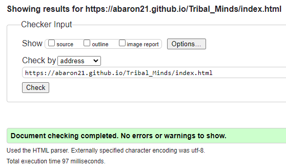
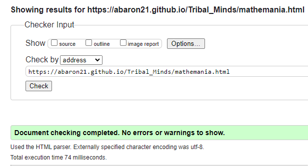
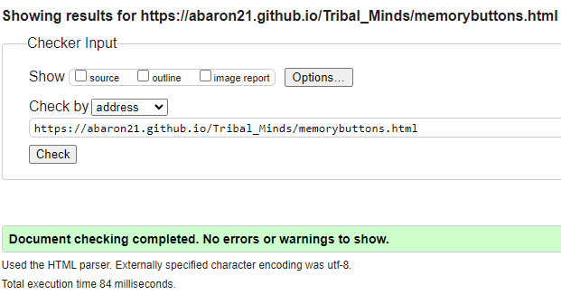

## Technology Used
Balsamiq Wireframes - Used to build/create the visual outline for the different web pages that the website consists of.

GitPod - Cloud based IDE used to create and build the code for the website.

HTML - Programming language used to build the structure of the website/web pages by the use of elements and different components.

CSS - The styling for the website, used to make the web pages more visually appealing.

Bootstrap - An external libary used that aims to focus on the resposiveness of the website.

JavaScript - Provides the functionality for the website, allowing for improved user interaction/expierience.

Jest - Testing environment used to test the javascript functions within the website.

GitHub - A cloud based storage used as the version control for the production by committing and pushing at various stages throughout the development.

GitPages - Used to deploy the final development.

----
# Testing

## Code Validation
### Landing Page
HTML

CSS

### Contact Page
HTML

CSS

### MatheMania Page
HTML

CSS

### MemoryMania(Circles) Page
HTML

CSS

### MemoryMania(Buttons) Page
HTML

CSS

## User Stories

### Navigating through Tribal Minds:

### Seeing feedback other users have given:

### Sending feedback to the developer:

### Selecting a different version of MemoryMania:

### Switching difficulites in a game:

### Bugs

### Screens

----
## Deployment
Two versions on deployment:
* GitPod - used throughout the development by typing 'python3 -m http.server' in the terminal which gives a prompt to open in a new tab within the browser.
* GitPages - the final deployment of the website which makes it accesible to the public.

----
## Credits