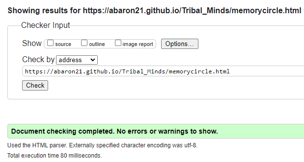
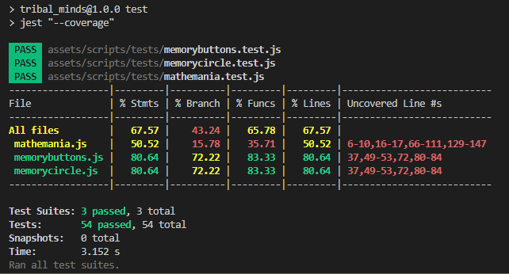
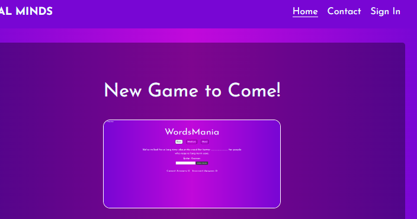
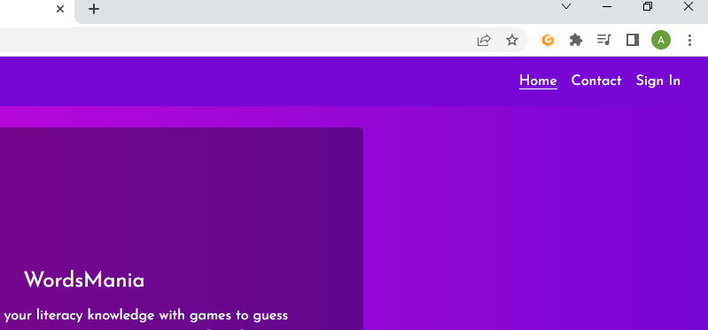
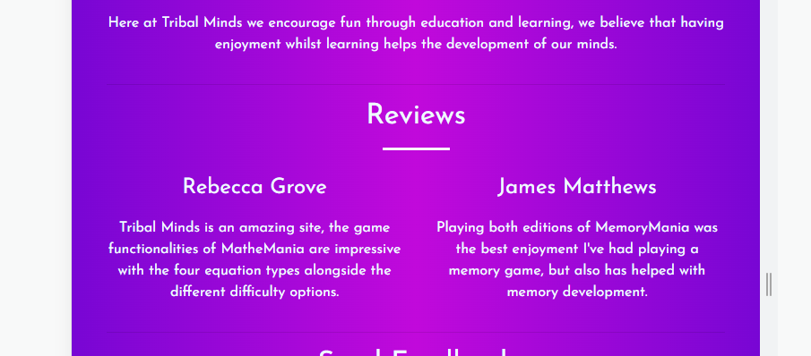
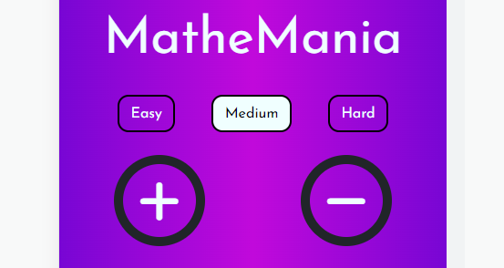

## Technology Used
Balsamiq Wireframes - Used to build/create the visual outline for the different web pages that the website consists of.

GitPod - Cloud based IDE used to create and build the code for the website.

HTML - Programming language used to build the structure of the website/web pages by the use of elements and different components.

CSS - The styling for the website, used to make the web pages more visually appealing.

Bootstrap - An external libary used that aims to focus on the resposiveness of the website.

JavaScript - Provides the functionality for the website, allowing for improved user interaction/expierience.

Jest - Testing environment used to test the javascript functions within the website.

GitHub - A cloud based storage used as the version control for the production by committing and pushing at various stages throughout the development.

GitPages - Used to deploy the final development.

----
# Testing

## Code Validation
### Landing Page
HTML

CSS

### Contact Page
HTML

CSS

### MatheMania Page
HTML

CSS

### MemoryMania(Circles) Page
HTML

CSS

### MemoryMania(Buttons) Page
HTML

CSS

### JavaScript Jest Tests

## User Stories

### Navigating through Tribal Minds:
1. Load the website.
2. Look at the top right of the page.
3. (Mobile device) Click the hamburger icon at the top right of the screen.

### Seeing feedback other users have given:
1. Navigate to the contact page.
2. Read the second section on the page.
3. (Small devices) Scroll down to the second section.

### Sending feedback to the developer:
1. Navigate to the contact page.
2. Go to the bottom of the page.
3. Fill in the name, email and message input fields.
4. Click the send button.

### Selecting a different version of MemoryMania:
1. Click the play button under the MemoryMania heading.
2. Select the radio button labelled with which version you want to play.
3. Click play at the bottom of the modal.

### Switching difficulites in a game:
1. Locate the 3 difficulty buttons on the screen/page.
2. Click on the medium difficulty.
3. The button will change once selected.

## Bugs

### JSDom Istalling & Implementing
This bug occurred closed to the beginning of the test driven development and the cause of this was because the jsdom test environment wasn't installed and imported properly into the test scripts.

Fixing the issues was a simple solution of searching and reading through the documentation for the latest version of jest and jsdom test environment, then just following the steps shown to install and import the test environment.

### Sending Feedback Trigger 405 Error
This issue didn't show up until the website was deployed to GitHub Pages, when a user would attempt to send feedback through the contact page and click the send button it would respond with a 405 'Method Not Allowed' response resulting in the user not being able to send feeback via emailJS.

Resolving this issue was a case of throughly checking through the form element within contact.html as well as the sendEmail.js file, after checking the code the cause of the issue was within the form attributes and it was fixed by removing the method attribute and taking out the 'return' in the onsubmit click attribute.

## Screens

----
## Deployment
Two versions on deployment:
* GitPod - used throughout the development by typing 'python3 -m http.server' in the terminal which gives a prompt to open in a new tab within the browser.
* GitPages - the final deployment of the website which makes it accesible to the public.

----
## Credits